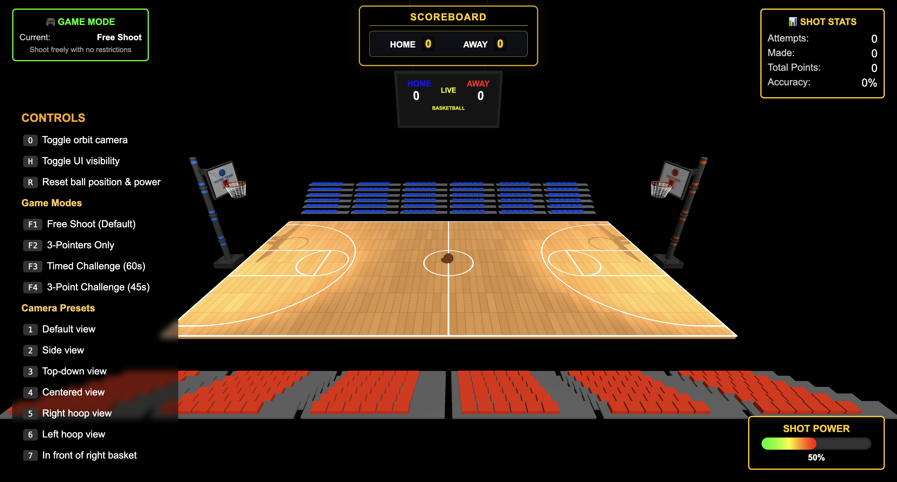
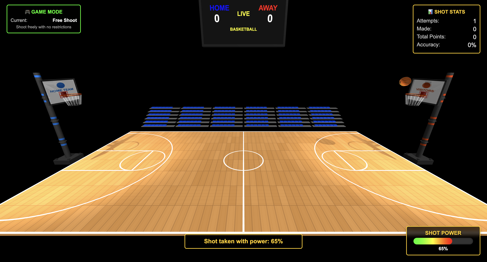
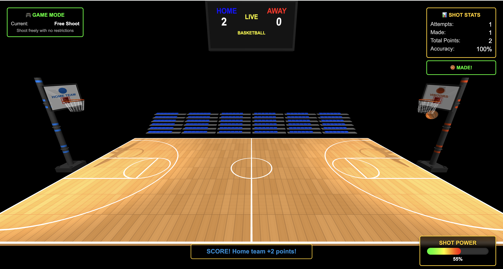

# Computer Graphics - Exercise 6 - WebGL Interactive Basketball Shooting Game with Physics

## Getting Started
1. Clone this repository to your local machine
2. Make sure you have Node.js installed
3. Start the local web server: `node index.js`
4. Open your browser and go to http://localhost:8000

## Complete Instructions
**All detailed instructions, requirements, and specifications can be found in:**
`basketball_exercise_hw06_instructions.html`

## Group Members
**MANDATORY: Add the full names of all group members here:**
- [Orian Daniel]
- [Gal Chohat]

## Technical Details
- Run the server with: `node index.js`
- Access at http://localhost:8000 in your web browser

## Mandatory Features
1. Physics-Based Basketball Movement
2. Interactive Basketball Controls
3. Basketball Rotation Animations
4. Comprehensive Scoring System
5. Enhanced User Interface

## Additional Features (Bonus)
- Time Challenge: Timed shooting challenges with countdown
- Net animation when scoring
- Game Modes: Different game modes (free shoot, 3pointers)

*Note that to see all the controls you can scroll down in the control panel

## Controls
- Arrow Keys: Move Basketball	
- W / S Keys: Adjust Shot Power	
- Spacebar:	Shoot Basketball
- R Key: Reset Basketball
- O Key: Toggle Camera
- H: Hide Control Panel
- 0-9: Camera Presets

## Description of physics system implementation

Our physics system implements realistic basketball mechanics in multiple components:

### 1. Gravity and Trajectory
- **Gravitational Force**: We apply Earth's gravity constant (-9.8 m/s²) to create realistic downward acceleration during shots
  - Theoretical formula: $a_y = g$ where $g$ is the gravitational acceleration (-9.8 m/s²)
  - Velocity change: $v_y(t) = v_y(0) + gt$
  - Position change: $y(t) = y(0) + v_y(0)t + \frac{1}{2}gt^2$
- **Air Resistance**: A small air resistance coefficient gradually reduces velocity to simulate atmospheric drag
  - Theoretical formula: $F_{drag} = -kv$ where $k$ is the drag coefficient
  - Velocity decay: $v(t) = v_0e^{-kt/m}$ where $m$ is the mass of the ball
- **Time-Based Physics**: All physics calculations use delta time between frames for consistent behavior regardless of frame rate
  - Euler integration: $x_{n+1} = x_n + v_n \Delta t$
  - Velocity update: $v_{n+1} = v_n + a_n \Delta t$
- **Parabolic Trajectory**: Shot mechanics produce natural arcs by calculating initial velocity components based on angle and power
  - Parametric equations: $x(t) = x_0 + v_{x0}t$ and $y(t) = y_0 + v_{y0}t + \frac{1}{2}gt^2$
  - Range equation: $R = \frac{v_0^2\sin(2\theta)}{g}$ where $\theta$ is the launch angle

### 2. Shot Mechanics
- **Adjustable Shot Power**: Players can adjust power (0-100%) using W/S keys, directly affecting initial velocity
  - Power to velocity mapping: $v_0 = v_{base} \cdot (p_{min} + p \cdot (p_{max} - p_{min}))$
  - Where $p$ is the normalized power input (0-1) and $v_{base}$ is the base velocity
- **Adaptive Shot Angles**: Shot angle automatically adjusts based on distance to basket
  - Optimal angle formula: $\theta_{opt} = \frac{\pi}{4} + \frac{1}{2}\arcsin(\frac{gh}{v_0^2})$
  - Where $h$ is the height differential between release and target
  - For variable distance: $\theta(d) = \theta_{max} - (d/d_{max})(\theta_{max} - \theta_{min})$
- **Initial Velocity Components**: Velocity is decomposed into horizontal and vertical components
  - Horizontal: $v_x = v_0 \cos(\theta)$
  - Vertical: $v_y = v_0 \sin(\theta)$
- **Height Adjustment**: Additional vertical component added based on target height differential
  - Vertical boost: $v_y = v_y + \Delta h \cdot k_{boost}$
  - Where $\Delta h$ is height difference and $k_{boost}$ is the boost factor

### 3. Ball Rotation Physics
- **Directional Rotation**: Ball rotation matches movement direction for realism
- **Backspin**: Consistent backspin applied during shots, proportional to horizontal speed
- **Side Spin**: Minor side spin added for natural ball movement
- **Random Component**: Slight random rotation added for realistic variation

### 4. Collision Detection and Response
- **Floor Collision**: Detects when ball hits the court floor and applies realistic bounce
- **Energy Loss**: Bounce factor (0.6) reduces velocity on each bounce to simulate energy loss
- **Surface Friction**: Horizontal velocity reduced after floor contact to simulate friction
- **Boundary Collisions**: Ball rebounds off court boundaries with energy loss (0.8 coefficient)

### 5. Scoring System Physics
- **Trajectory Analysis**: Maintains history of ball positions to detect downward trajectory through hoop
- **Height Detection**: Precise height thresholds ensure ball passes through at correct height
- **Position Verification**: Horizontal position checks ensure ball passes through center of rim
- **Net Animation**: Physics-based wave animation of net when ball passes through

### 6. Interactive Movement
- **Smooth Acceleration/Deceleration**: Gradual speed changes rather than instant movement
- **Realistic Dribble Bounce**: When moving the ball on the court, a sinusoidal bounce animation simulates dribbling
- **Momentum**: Ball maintains some momentum when changing direction
- **Speed Limits**: Maximum speed caps prevent unrealistic movement

Our physics implementation creates a satisfying and realistic basketball shooting experience while maintaining good performance.

## Screenshots

*Game start screen with controls panel*

*Basketball mid-flight during a shot attempt*

*Score update display after a successful shot*

## Video

[Download Game Demo Video](screenshots/gamePlayDemo.mov)

*Note: The gameplay demonstration video shows the interactive basketball game with physics-based movement, shooting mechanics, and scoring system in action. Download and play the video to see all implemented features.*